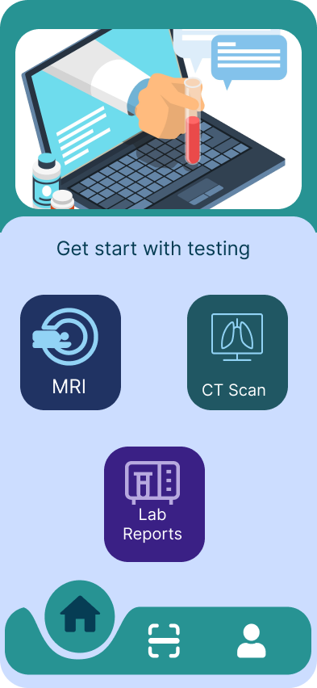

# MediScan


## Project Overview
MediScan is a medical lab report analyzing application designed to assist individuals without medical expertise in understanding complex medical reports. Utilizing advanced machine learning and neural networks, MediScan interprets various lab reports, including pathology, microbiology, and biochemistry, providing intuitive insights and interpretations of the data.

## Key Features
- **Real-Time Analysis**: Implement real-time medical lab report analysis using machine learning algorithms.
- **User-Friendly Interface**: Simple and intuitive interface to interpret lab reports.
- **Data Confidentiality**: Ensures data confidentiality and privacy through a secure framework.
- **Accessibility**: Accessible across various devices for expanded health monitoring.

## Problem Statement
The current landscape of medical lab reports presents a formidable barrier for individuals lacking medical expertise. The intricate nature of these reports complicates interpretation and analysis for non-medical users. This gap in accessibility to user-friendly tools inhibits independent comprehension and identification of anomalies within these reports, leading to increased reliance on healthcare professionals for interpretation. 
### MediScan aims to bridge this gap by providing an intuitive solution that empowers individuals to understand and monitor their health data autonomously.

## Objectives
- Implement real-time analysis of medical lab reports using machine learning algorithms.
- Interpret lab reports in a simple and understandable format.

## Tools and Technologies
- **Git & GitHub**: Version Control
- **Flutter & Dart**: Mobile App Development
- **Python & Django**: Machine Learning Backend
- **Jupyter Notebook**: Data Analysis
- **Visual Studio Code**: Development Environment
- **Draw.io**: UML Diagrams
- **MS-Word & PowerPoint**: Documentation

## Key Screenshots




## How to Install and Use MediScan
1. **Clone the Repository**:
    ```sh
    git clone https://github.com/subiiiiiii/mediScan.git
    ```
2. **Install Dependencies**:
    Navigate to the project directory and install the required dependencies.
    ```sh
    cd mediScan
    flutter pub get
    pip install -r requirements.txt
    ```
3. **Run the Application**:
    ```sh
    flutter run
    ```

## Contribution Guidelines
We welcome contributions to MediScan! To contribute, please follow these steps:
1. Fork the repository.
2. Create a new branch (`git checkout -b feature-branch`).
3. Make your changes and commit them (`git commit -m 'Add some feature'`).
4. Push to the branch (`git push origin feature-branch`).
5. Open a pull request.


## Contact
For any queries or issues, please contact us at [pokharelsubi@gmail.com](mailto:pokharelsubi@gmail.com).

---
